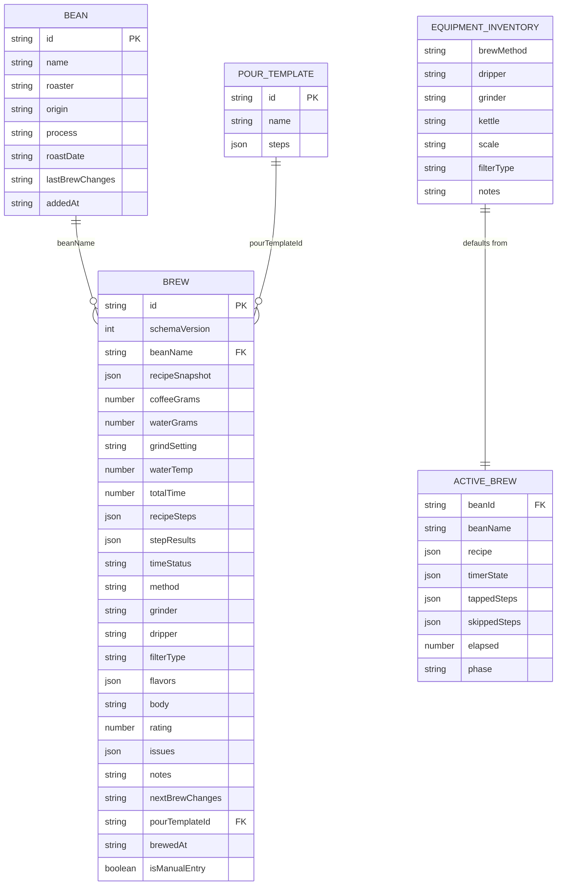

# Foundation Stabilization

## Overview

Moderate restructuring of BrewLog that fixes data inconsistencies and establishes a clean separation between recipe (what you planned) and session (what actually happened). Not a rewrite — targeted structural improvements to working code.

**Scope:** Unified brew schema, recipe snapshots, merged Finish/Commit flow, per-recipe equipment, skip-timer mode, CLAUDE.md update, test foundation.

**Out of scope:** TypeScript conversion, backend/database, roaster platform, social sharing, AI coach, PWA.

## Problem Statement

Three specific problems compound into the "fix one, break another" cycle:

1. **Two brew creation paths produce incompatible data.** BrewForm creates records with legacy step format (`{ label, startTime, targetWater, note }`) and fields like `bloomTime`. BrewScreen creates records with new step format (`{ id, name, waterTo, time, duration, note }`) plus `stepResults`, `timeStatus`, `nextBrewChanges`, `pourTemplateId`. Both write to the same `brewlog_brews` array. BrewHistory reads legacy field names and silently shows incomplete data for BrewScreen brews.

2. **"Finish Brew" doesn't save.** Between pressing "Finish Brew" (stops timer) and "Commit Brew" (saves to localStorage), all data lives only in React state. Closing the tab, refreshing, or navigating away loses the brew. Active brew persistence covers Phase 2 (timer running) but not Phase 3 (post-brew entry).

3. **Equipment is global but should be per-brew.** Users switching between devices (V60 vs Kalita Wave) have no way to track which device was used for each brew. The global equipment object provides defaults but cannot record per-brew deviations.

## Proposed Solution

### Unified Brew Schema

One canonical brew record shape for all brews. BrewScreen format wins. Legacy brews are migrated forward on app load.

```javascript
{
  // Identity
  id: "uuid",
  schemaVersion: 2,           // migration tracking (current brews have 0 or 1)

  // Bean reference
  beanName: "Heart Colombia Javier Omar",
  roaster: "Heart",
  roastDate: "2026-02-10",

  // Recipe snapshot (frozen at brew start, never edited after)
  recipeSnapshot: {
    coffeeGrams: 20,
    waterGrams: 320,
    grindSetting: "6-1",
    waterTemp: 205,
    targetTime: 210,
    targetTimeRange: "3:00-3:30",
    targetTimeMin: 180,
    targetTimeMax: 210,
    steps: [
      { id: 1, name: "Bloom", waterTo: 42, time: 0, duration: 40, note: "Gentle spiral" }
    ],
    pourTemplateId: "standard-3pour-v60",
    method: "v60",
    grinder: "fellow-ode",
    dripper: "ceramic",
    filterType: "paper-tabbed"
  },

  // Actual values (what happened — editable post-brew via "Rate This Brew")
  coffeeGrams: 20,            // defaults to planned, user can correct
  waterGrams: 320,
  grindSetting: "6-2",        // user corrected post-brew
  waterTemp: 205,
  totalTime: 215,             // actual elapsed from timer (or manual entry)

  // Steps (unified format — always present)
  recipeSteps: [
    { id: 1, name: "Bloom", waterTo: 42, time: 0, duration: 40, note: "Gentle spiral" }
  ],

  // Execution data (from timer, null for manual/legacy brews)
  stepResults: {              // null for skip-timer and legacy brews
    "1": { tappedAt: 42, skipped: false, variance: 2 }
  },
  timeStatus: "over",         // "under" | "over" | "on-target" | null

  // Equipment used for this brew
  method: "v60",
  grinder: "fellow-ode",
  dripper: "ceramic",
  filterType: "paper-tabbed",

  // Tasting
  flavors: ["Chocolate", "Citrus"],
  body: "Medium",
  rating: 4,
  issues: ["Stalled bed"],
  notes: "Bed stalled at 3:00, lifted filter early",

  // Iteration
  nextBrewChanges: "Try coarser grind, faster pour on step 2",
  pourTemplateId: "standard-3pour-v60",

  // Metadata
  brewedAt: "2026-02-23T08:30:00Z",
  isManualEntry: false,       // true for skip-timer brews
}
```

**Key design decisions:**
- `recipeSnapshot` is frozen at brew start. Captures what was planned including equipment.
- Top-level fields (`coffeeGrams`, `grindSetting`, `totalTime`, etc.) are "what actually happened" — editable on the rating screen.
- For legacy brews without `recipeSnapshot`: top-level fields serve as both planned and actual. No planned-vs-actual comparison available. That's fine.
- `schemaVersion: 2` enables idempotent migration detection. Current BrewScreen brews have `brewScreenVersion: 1`. Legacy BrewForm brews have neither.
- `stepResults` is null for skip-timer and legacy brews (no timer data).
- `isManualEntry` distinguishes skip-timer brews.

### ERD



**Notes:**
- `BEAN → BREW` relationship is via string name (not UUID). Rename cascade via `renameBrewBean()` enforces integrity.
- `EQUIPMENT_INVENTORY` is a singleton — one record, not an array. Per-brew equipment lives on each `BREW` record.
- `ACTIVE_BREW` is a singleton — at most one in-progress brew. Now includes `phase` field to support recovery into post-brew rating.

### Post-Brew Flow (Merged Finish/Commit)

```
Phase 2 (ActiveBrew)
  ↓ User presses "Finish Brew"
  ↓ timer.stop() returns elapsed
  ↓ Construct brew record with recipeSnapshot + actuals + stepResults
  ↓ saveBrew(brew) → writes to localStorage immediately
  ↓ Update active brew: { ...state, phase: 'rate', brewId: brew.id }
  ↓
Phase 3 (RateThisBrew) — NEW, replaces PostBrewCommit
  ↓ Three sections:
  ↓   1. Correct Actuals: grindSetting, totalTime editable
  ↓   2. Tasting: flavors, body, rating, issues, notes
  ↓   3. What To Try Next: nextBrewChanges textarea
  ↓ Each section auto-saves or saves on section collapse/blur
  ↓ "Done" button → updateBrew(brewId, changes) + clearActiveBrew()
  ↓
Phase 4 (Success) — existing "committed" phase
  ↓ "Start New Brew" or "View in History"
```

**Save timing:** Brew record hits localStorage on "Finish Brew." The rating screen calls `updateBrew()` to add tasting data. If user leaves mid-rating, the brew exists in history with no tasting data (but timer data is preserved). This is acceptable — better than losing the whole brew.

**Active brew persistence change:** Add `phase` field to active brew state. On recovery:
- If `phase === 'brew'`: resume timer (current behavior)
- If `phase === 'rate'`: skip to rating screen with saved brewId
- If `phase` is absent: legacy behavior (assume 'brew')

### Pre-fill Logic

When building recipe for a returning bean:
1. `getLastBrewOfBean(beanName)` returns most recent brew
2. Recipe fields pre-fill from **top-level actuals** (not `recipeSnapshot`)
3. This means if user corrected grind from 6-1 to 6-2 post-brew, next brew starts at 6-2
4. `nextBrewChanges` from last brew surfaces as reminder in RecipeAssembly
5. "Revert to template" button loads original pour template steps (via `pourTemplateId` → `getPourTemplates()`)

### Equipment Per-Recipe

**Equipment setup becomes an inventory** — what you own. Currently it's already a singleton with fields for method, dripper, grinder, kettle, scale, filterType. No schema change needed for the inventory itself.

**RecipeAssembly gets an equipment section:**
- Compact by default: shows "V60 · Fellow Ode · Paper tabbed" as a single line
- Tap to expand: shows method, dripper, grinder, filter as selectable fields
- Options come from `defaults.js` lists (BREW_METHODS, GRINDERS, etc.)
- Changes apply to this brew only — do NOT update global equipment
- Changing grinder swaps the grind input widget (Ode select vs numeric vs text)

**Brew record stores per-brew equipment** in top-level fields (`method`, `grinder`, `dripper`, `filterType`). The `recipeSnapshot` also captures equipment at brew start for planned-vs-actual comparison.

### Skip-Timer Mode

- "Log without timer" button added to RecipeAssembly (alongside "Brew This")
- Bypasses Phase 2 (ActiveBrew) entirely
- Transitions to a variant of Phase 3 (RateThisBrew) with:
  - Manual `totalTime` input (MM:SS format)
  - No step timing report section
  - All tasting fields available
- Brew record has `isManualEntry: true`, `stepResults: null`, `timeStatus: null`
- `totalTime` comes from manual input, not timer

---

## Technical Approach

### Architecture

All changes stay within the existing React/props-down architecture. No new state management. No new localStorage keys. The storage layer remains the single point of data access.

**Files that change:**

| File | Change Type | Description |
|------|-------------|-------------|
| `CLAUDE.md` | Update | Document full current app including BrewScreen era |
| `src/data/storage.js` | Modify | Migration function, recipeSnapshot helpers, unified normalizeSteps |
| `src/components/BrewScreen.jsx` | Modify | Merge Finish/Commit, recipeSnapshot, equipment section, skip-timer, RateThisBrew |
| `src/components/BrewForm.jsx` | Modify | Scope to edit-only, preserve unified format fields |
| `src/components/BrewHistory.jsx` | Modify | Render unified format, remove local normalizeSteps duplicate |
| `src/components/EquipmentSetup.jsx` | Modify | Minor: label as "equipment inventory" |
| `src/data/defaults.js` | Minor | No structural changes expected |
| `src/App.jsx` | Modify | Add migration call, remove BrewForm new-brew rendering |
| `package.json` | Modify | Add vitest + testing-library deps |
| `vite.config.js` | Modify | Add vitest config |
| `src/data/__tests__/storage.test.js` | New | Storage layer tests |
| `src/data/__tests__/migration.test.js` | New | Migration tests |

**Files that don't change:** `Header.jsx`, `MobileNav.jsx`, `FlavorPicker.jsx`, `BrewTrends.jsx` (minor — may need grinder-aware filtering later), `useTimer.js`, `useWakeLock.js`.

### Implementation Phases

#### Phase 1: Documentation & Test Foundation

**Goal:** Accurate CLAUDE.md and a test harness that protects the storage layer during subsequent changes.

**Tasks:**

- [x] **1.1 Update CLAUDE.md** (`CLAUDE.md`)
  - Document BrewScreen.jsx (largest component, 1,348 lines, 5 sub-components, phase state machine)
  - Document useTimer.js and useWakeLock.js hooks
  - Document Pour Template entity and `brewlog_pour_templates` key
  - Document Active Brew persistence and `brewlog_active_brew` key
  - Document dual step formats (label as "legacy" and "current")
  - Fix localStorage key count (6, not 4)
  - Fix equipment field name (`brewMethod` in storage, `method` on brew records)
  - Fix todo count
  - Add BrewScreen phase state machine: `pick → recipe → brew → commit → committed`
  - Add navigation guard documentation
  - Add the unified brew schema (from this plan) as the target data model

- [x] **1.2 Set up Vitest** (`package.json`, `vite.config.js`)
  - Install vitest, @testing-library/react, @testing-library/jest-dom, jsdom
  - Add `test` script to package.json
  - Configure vitest in vite.config.js with jsdom environment
  - Add `localStorage` mock for test environment

- [x] **1.3 Write storage layer tests** (`src/data/__tests__/storage.test.js`)
  - Test `saveBrew()` / `getBrews()` round-trip
  - Test `updateBrew()` preserves fields not in the update payload
  - Test `getLastBrewOfBean()` with case-insensitive matching
  - Test `normalizeSteps()` converts legacy → new format correctly
  - Test `normalizeSteps()` passes through new-format steps unchanged
  - Test `migrateBloomToSteps()` idempotency
  - Test `migrateGrindSettings()` idempotency
  - Test `deduplicateBeans()` with mixed-case duplicates
  - Test `renameBrewBean()` cascades to all matching brews

**Verification:** `npm test` passes. CLAUDE.md accurately describes the current app.

**Success criteria:**
- [ ] CLAUDE.md documents all 6 localStorage keys
- [ ] CLAUDE.md documents BrewScreen phase state machine
- [ ] `npm test` runs and passes all storage tests
- [ ] Tests cover saveBrew, updateBrew, getLastBrewOfBean, normalizeSteps, both migrations

---

#### Phase 2: Data Unification & Migration

**Goal:** One brew record shape, one step format, all existing data migrated forward.

**Tasks:**

- [x] **2.1 Write migration function** (`src/data/storage.js`)
  - New function: `migrateToSchemaV2()`
  - Follow existing migration pattern: idempotent check → in-place mutation → batch write
  - Idempotency guard: skip brews where `schemaVersion >= 2`
  - For legacy BrewForm brews (no `brewScreenVersion`):
    - Convert `recipeSteps` from legacy to new step format via `normalizeSteps()`
    - Convert `steps` (actual) from legacy to new format
    - Map `bloomTime`/`bloomWater` into step data if not already migrated
    - Set `stepResults: null` (no timer data available)
    - Set `timeStatus: null`
    - Set `nextBrewChanges: null`
    - Set `pourTemplateId: null`
    - Set `isManualEntry: true` (these were manual-entry brews)
    - Set `recipeSnapshot: null` (no snapshot available for historical brews)
    - Set `schemaVersion: 2`
  - For BrewScreen brews (`brewScreenVersion: 1`):
    - `recipeSteps` already in new format — no step conversion needed
    - Set `recipeSnapshot: null` (not captured at brew time historically)
    - Ensure `notes` field has actual content (fix dual-field bug: `notes` vs `brewNotes`)
    - Set `isManualEntry: false`
    - Set `schemaVersion: 2`
    - Remove `brewScreenVersion` field (superseded by `schemaVersion`)
  - **Pre-migration backup:** Store copy of raw brews JSON in `brewlog_brews_backup_v1` localStorage key before mutating. This is cheap insurance — can be cleared after user confirms app works.

- [x] **2.2 Consolidate normalizeSteps** (`src/data/storage.js`, `src/components/BrewHistory.jsx`)
  - Remove the local `normalizeSteps()` in BrewHistory.jsx (line 36-38) that only does array validation
  - Import `normalizeSteps` from storage.js wherever needed
  - Add array validation to the canonical `normalizeSteps()` (handle null/undefined input)

- [x] **2.3 Update BrewHistory to render unified format** (`src/components/BrewHistory.jsx`)
  - Update expanded card to read `step.name` instead of `step.label`
  - Update expanded card to read `step.waterTo` instead of `step.targetWater`
  - Update expanded card to read `step.time` instead of `step.startTime`
  - Add `stepResults` display in expanded card (show tapped times, skipped indicators)
  - Update `stepsChanged` comparison to use new field names
  - Handle brews with `stepResults: null` gracefully (legacy/manual brews)

- [x] **2.4 Update BrewForm edit mode** (`src/components/BrewForm.jsx`)
  - When editing a unified-format brew, preserve `recipeSnapshot`, `stepResults`, `timeStatus`, `schemaVersion`, `isManualEntry`, `pourTemplateId`, `nextBrewChanges` — all fields the form doesn't manage
  - Use refs to track which fields user actually modified (per documented learning: edit-form-overwrites-fields-it-doesnt-manage)
  - Update StepEditor to read/write new step format (`name` not `label`, `waterTo` not `targetWater`, `time` not `startTime`)
  - On save: merge user changes with preserved original fields, don't spread entire form

- [x] **2.5 Wire migration into app init** (`src/App.jsx`)
  - Add `migrateToSchemaV2()` call in the brews lazy initializer, after existing migrations
  - Order: `migrateGrindSettings()` → `seedDefaultPourTemplates()` → `migrateBloomToSteps()` → `migrateToSchemaV2()`

- [x] **2.6 Write migration tests** (`src/data/__tests__/migration.test.js`)
  - Test: BrewForm-only brew → unified format (steps converted, bloom mapped, null fields set)
  - Test: BrewScreen brew → unified format (notes fixed, version updated)
  - Test: Already-migrated brew → unchanged (idempotency)
  - Test: Hybrid brew (BrewScreen-created, edited via BrewForm) → handles gracefully
  - Test: Empty brews array → no error
  - Test: Backup created in `brewlog_brews_backup_v1`

**Verification:** All existing brews render correctly in History. Edit a legacy brew → save → no data loss. Edit a BrewScreen brew → save → stepResults preserved. `npm test` passes all migration tests.

**Success criteria:**
- [x] All brews have `schemaVersion: 2` after app load
- [x] BrewHistory displays both legacy and BrewScreen brews with correct step data
- [x] Editing a BrewScreen brew via BrewForm preserves stepResults, timeStatus, nextBrewChanges
- [x] StepEditor reads/writes new step format
- [x] Migration is idempotent (running twice produces same result)
- [x] Backup exists in `brewlog_brews_backup_v1`

---

#### Phase 3: Recipe Snapshot & Post-Brew Flow

**Goal:** Finish Brew saves immediately. Recipe snapshot captures the plan. Rating screen lets you correct actuals and add tasting notes.

**Tasks:**

- [ ] **3.1 Add recipeSnapshot to brew creation** (`src/components/BrewScreen.jsx`)
  - When "Finish Brew" is pressed, construct `recipeSnapshot` from current `recipe` state:
    ```javascript
    recipeSnapshot: {
      coffeeGrams: recipe.coffeeGrams,
      waterGrams: recipe.waterGrams,
      grindSetting: recipe.grindSetting,
      waterTemp: recipe.waterTemp,
      targetTime: recipe.targetTime,
      targetTimeRange: recipe.targetTimeRange,
      targetTimeMin: recipe.targetTimeMin,
      targetTimeMax: recipe.targetTimeMax,
      steps: structuredClone(recipe.steps),
      pourTemplateId: recipe.pourTemplateId,
      method: equipment?.brewMethod,
      grinder: equipment?.grinder,
      dripper: equipment?.dripper,
      filterType: equipment?.filterType,
    }
    ```
  - Top-level fields start as copies of recipe values (same as recipeSnapshot initially)
  - `totalTime` comes from `timer.stop()` (actual elapsed)

- [ ] **3.2 Merge Finish/Commit into single action** (`src/components/BrewScreen.jsx`)
  - "Finish Brew" button now:
    1. Stops timer
    2. Constructs full brew record (with recipeSnapshot, actuals, stepResults)
    3. Calls `saveBrew(brew)` — record now in localStorage
    4. Updates active brew state: `saveActiveBrew({ ...state, phase: 'rate', brewId: brew.id })`
    5. Calls `onBrewSaved(updatedBrews)` to sync App.jsx state
    6. Transitions to Phase 3 (`setPhase('rate')`)
  - Remove the separate "Commit Brew" button and `PostBrewCommit` sub-component
  - Double-save guard via `savingRef` (preserved from PostBrewCommit)

- [ ] **3.3 Build RateThisBrew sub-component** (`src/components/BrewScreen.jsx`)
  - Replaces PostBrewCommit
  - Props: `brew` (the saved record), `equipment`, `onComplete`, `onBrewUpdated`
  - Three collapsible sections:
    - **Correct Actuals**: `grindSetting` input (grinder-aware), `totalTime` input (MM:SS), editable summary
    - **Tasting Notes**: FlavorPicker, body selector, rating (1-5 stars), issues tags, notes textarea (all existing UI, moved from PostBrewCommit)
    - **What To Try Next**: `nextBrewChanges` textarea (existing)
  - "Done" button: calls `updateBrew(brew.id, allChanges)`, `clearActiveBrew()`, transitions to success phase
  - Also writes `lastBrewChanges` to bean if `nextBrewChanges` is non-empty
  - Auto-save on section collapse or input blur (debounced, not per-keystroke — per documented learning)

- [ ] **3.4 Update active brew persistence for post-brew recovery** (`src/components/BrewScreen.jsx`)
  - Add `phase` field to active brew state
  - During Phase 2 (timer): `saveActiveBrew({ ..., phase: 'brew' })`
  - On Finish Brew: `saveActiveBrew({ ..., phase: 'rate', brewId: brew.id })`
  - On recovery mount:
    - If `phase === 'brew'`: resume timer (current behavior)
    - If `phase === 'rate'`: look up brew by `brewId` in brews array, skip to RateThisBrew
    - If `phase` absent: legacy, treat as 'brew'
  - `clearActiveBrew()` called only on "Done" in RateThisBrew (not on Finish Brew)

- [ ] **3.5 Promote success to formal phase** (`src/components/BrewScreen.jsx`)
  - Phase state machine becomes: `pick → recipe → brew → rate → success`
  - Remove the `committed` naming — `success` is clearer
  - Per documented learning: terminal states must be formal phases, not booleans
  - Success phase shows checkmark + "Start New Brew" / "View in History" (existing UI)

- [ ] **3.6 Update pre-fill to use actual values** (`src/components/BrewScreen.jsx`)
  - `buildRecipeFromBean()` already reads from top-level brew fields
  - After Phase 2 migration, top-level fields are "actuals" (user-corrected)
  - No code change needed here if the unified schema is correct
  - Verify: if user corrected grind from 6-1 to 6-2 on the rating screen, next brew pre-fills 6-2

**Verification:** Start brew → Finish Brew → record appears in History immediately (with no tasting data). Fill in rating on RateThisBrew → Done → record updated in History with tasting data. Close browser during RateThisBrew → reopen → prompted to resume rating (not re-run timer). Run `npm test`.

**Success criteria:**
- [ ] "Finish Brew" saves to localStorage immediately (no data-loss window)
- [ ] No separate "Commit Brew" step
- [ ] Rating screen edits an already-saved brew via updateBrew()
- [ ] recipeSnapshot captured on every new brew
- [ ] Crash during rating → recovery resumes at rating screen (not timer)
- [ ] Pre-fill for returning bean uses corrected actuals

---

#### Phase 4: Equipment Per-Recipe & Single Brew Path

**Goal:** Users can select equipment per-brew. All new brews go through BrewScreen. Skip-timer mode for logging past brews.

**Tasks:**

- [ ] **4.1 Add equipment section to RecipeAssembly** (`src/components/BrewScreen.jsx`)
  - New collapsible section below step cards
  - **Compact view** (default): single line — "V60 · Fellow Ode · Paper tabbed"
  - **Expanded view**: selectable fields for method, dripper, grinder, filterType
  - Options sourced from `defaults.js` lists (BREW_METHODS, GRINDERS, FILTER_TYPES)
  - Selections stored in `recipe` state: `recipe.method`, `recipe.grinder`, `recipe.dripper`, `recipe.filterType`
  - Initialize from global equipment defaults
  - Changes apply to this brew only — do NOT update `brewlog_equipment`
  - When grinder changes, swap grind input widget (Ode select vs numeric vs text)

- [ ] **4.2 Update brew record creation for per-brew equipment** (`src/components/BrewScreen.jsx`)
  - Source `method`, `grinder`, `dripper`, `filterType` from `recipe` state (not global `equipment` prop)
  - `recipeSnapshot` also captures these from recipe state
  - Global `equipment` prop still used for defaults when building recipe

- [ ] **4.3 Add skip-timer mode** (`src/components/BrewScreen.jsx`)
  - "Log without timer" button in RecipeAssembly (alongside "Brew This")
  - On click: construct brew record from recipe, set `isManualEntry: true`, `stepResults: null`, `timeStatus: null`, `totalTime: null`
  - Call `saveBrew(brew)` immediately
  - Transition to RateThisBrew with manual `totalTime` input prominently shown
  - No step timing report section in RateThisBrew for manual brews
  - No active brew persistence needed (no timer to recover)

- [ ] **4.4 Scope BrewForm to edit-only** (`src/components/BrewForm.jsx`, `src/App.jsx`)
  - Remove the new-brew creation path from BrewForm (keep edit-brew path only)
  - In App.jsx: remove BrewForm rendering for `view === 'brew'` when `!editingBrew`
  - BrewScreen is now the sole entry point for new brews
  - BrewForm edit mode already updated in Phase 2 to handle unified format

- [ ] **4.5 Add "Revert to template" option** (`src/components/BrewScreen.jsx`)
  - In RecipeAssembly, when a returning bean has pre-filled from last brew:
  - Show "Revert to template" link/button
  - On click: load steps from the original pour template (via `pourTemplateId` → `getPourTemplates()`)
  - Only reverts steps and pourTemplateId — keeps other recipe fields (dose, grind, temp) from last brew
  - If `pourTemplateId` is null (legacy brews), show pour template picker instead

- [ ] **4.6 Update BrewHistory for per-brew equipment display** (`src/components/BrewHistory.jsx`)
  - Show equipment used on each brew in expanded card (method, grinder, dripper)
  - Highlight when equipment differs from previous brew of same bean (auto-diff)

**Verification:** Change dripper in recipe assembly → brew → verify brew record stores per-brew equipment, global equipment unchanged. Log a brew without timer → verify appears in history with `isManualEntry: true`. Start a new brew → verify only BrewScreen renders (not BrewForm). Revert to template → verify only steps change.

**Success criteria:**
- [ ] Equipment section visible in RecipeAssembly, compact by default
- [ ] Per-brew equipment stored on brew record, global equipment unaffected
- [ ] Skip-timer brew appears in history with correct fields
- [ ] BrewForm only renders for editing existing brews
- [ ] "Revert to template" replaces steps without affecting other recipe fields

---

#### Phase 5: Polish & Acceptance Testing

**Goal:** Pass the acceptance criterion. Clean up dead code. Final CLAUDE.md update.

**Tasks:**

- [ ] **5.1 End-to-end acceptance testing**
  - **Test A — New bean:** Open app → Brew tab → pick a new bean → select template → assemble recipe with equipment → "Brew This" → timer runs → tap steps → "Finish Brew" → correct actuals if needed → add tasting notes → "what to try next" → Done → appears in History with all data
  - **Test B — Returning bean:** Open app → Brew tab → pick same bean → verify recipe pre-fills from last brew's actuals → verify "Notes from last brew" surfaces → tweak recipe → brew → finish → rate → Done → History shows correct same-bean comparison
  - **Test C — Edit past brew:** Open History → expand a brew → Edit → modify fields → save → verify no data loss (especially stepResults, recipeSnapshot)
  - **Test D — Skip-timer:** Open app → pick bean → "Log without timer" → enter time → rate → Done → appears in History
  - **Test E — Crash recovery during rating:** Start brew → finish → close tab during rating → reopen → verify prompted to resume rating, not timer

- [ ] **5.2 Remove dead code**
  - Remove BrewForm new-brew creation logic (keep edit mode only)
  - Remove `PostBrewCommit` sub-component (replaced by RateThisBrew)
  - Remove `committed` boolean in PostBrewCommit (replaced by `success` phase)
  - Remove duplicate `normalizeSteps` in BrewHistory (consolidated in Phase 2)
  - Remove legacy bloom fields from form initialization (`bloomTime`, `bloomWater`, `actualBloomTime`, `actualBloomWater`) if migration handles them

- [ ] **5.3 Update CLAUDE.md with final state**
  - Document unified brew schema as the canonical data model
  - Document new phase state machine: `pick → recipe → brew → rate → success`
  - Document RateThisBrew sub-component
  - Document skip-timer mode
  - Document per-brew equipment
  - Update Patterns & Conventions with new patterns discovered during implementation
  - Update Bugs & Lessons Learned section

- [ ] **5.4 Fix remaining edge cases**
  - Verify BrewTrends handles unified format (grind trend with mixed grinders — filter by grinder or annotate)
  - Verify import/export handles unified format (mergeData, exportData)
  - Verify bean deduplication still works across all write paths
  - Test with empty state (no brews, no beans, no equipment)
  - Test with large dataset (100+ brews) to check migration performance

**Verification:** All 5 acceptance tests pass. `npm test` passes. `npm run build` succeeds. No console errors.

**Success criteria:**
- [ ] Tests A through E all pass without data loss or navigation dead-ends
- [ ] `npm test` passes all unit tests
- [ ] `npm run build` succeeds with no errors
- [ ] CLAUDE.md accurately describes the final app state

---

## Acceptance Criteria

### Functional Requirements

- [ ] Every new brew stores a `recipeSnapshot` frozen at brew start
- [ ] "Finish Brew" saves the brew record to localStorage immediately
- [ ] Rating screen allows correcting grind, total time, and adding tasting notes
- [ ] Pre-fill for returning beans uses corrected actual values from last brew
- [ ] Equipment is selectable per-brew in recipe assembly
- [ ] Skip-timer mode allows logging brews without using the timer
- [ ] All brews in history display correctly regardless of original creation path
- [ ] Editing a past brew preserves all fields the user didn't modify

### Quality Gates

- [ ] Storage layer tests exist and pass
- [ ] Migration tests exist and pass (including idempotency)
- [ ] `npm run build` produces no errors
- [ ] CLAUDE.md documents all entities, keys, phases, and patterns
- [ ] Pre-migration backup stored in `brewlog_brews_backup_v1`

---

## Risk Analysis & Mitigation

| Risk | Likelihood | Impact | Mitigation |
|------|-----------|--------|------------|
| Migration corrupts existing brew data | Medium | High | Pre-migration backup in `brewlog_brews_backup_v1`. Migration is idempotent. Write migration tests first. |
| BrewScreen.jsx becomes unwieldy (already 1,348 lines) | High | Medium | RateThisBrew replaces PostBrewCommit (net neutral). Equipment section adds ~100 lines. Consider extracting sub-components to separate files if it exceeds 1,500 lines. |
| Edit form overwrites unified-format fields | Medium | High | Apply documented learning: use refs to track modified fields, preserve originals for unmodified fields. Write specific tests for this. |
| Per-brew equipment breaks BrewTrends grind chart | Low | Low | Defer trend filtering to a follow-up. Grind values are already strings — mixed grinders produce mixed scales. Annotate or filter in future sprint. |
| localStorage quota hit with larger brew records | Low | Medium | recipeSnapshot roughly doubles record size. For 200 brews, estimate ~2MB (well within 5MB limit). Monitor in Phase 5 testing. |

---

## Documented Learnings to Apply

These are from `docs/solutions/` and directly affect implementation:

1. **Edit form preserves unmodified fields via refs** — `docs/solutions/logic-errors/edit-form-overwrites-fields-it-doesnt-manage.md` — Use `stepsModifiedRef`, `grindModifiedRef` etc. in BrewForm edit mode.
2. **Terminal states must be formal phases** — `docs/solutions/react-patterns/terminal-state-must-be-a-formal-phase.md` — The `success` phase replaces `committed` boolean.
3. **Timer stop must flush pause gap** — `docs/solutions/react-patterns/timer-stop-must-flush-pause-gap.md` — Already fixed in PR #21, but verify it works in the new Finish-saves flow.
4. **Dual field names cause silent loss** — `docs/solutions/logic-errors/dual-field-names-for-same-data-cause-silent-loss.md` — Migration must consolidate `notes` vs `brewNotes`.
5. **Per-keystroke localStorage writes cascade** — `docs/solutions/performance/per-keystroke-localstorage-writes-cause-render-cascade.md` — RateThisBrew should save on blur/collapse, not per-keystroke.
6. **Reset handler must clear all state** — `docs/solutions/react-patterns/reset-handler-must-clear-all-related-state.md` — "Start New Brew" from success phase must clear: selectedBean, recipe, brewData, savedBrewState, phase, AND per-brew equipment state.
7. **UI state must not leak into domain objects** — `docs/solutions/react-patterns/ui-state-in-data-objects-leaks-to-persistence.md` — Keep `needsTemplatePick` and similar routing flags out of the `recipe` object.
8. **Persist-restore must be end-to-end** — `docs/solutions/react-patterns/persist-and-restore-must-be-end-to-end.md` — Active brew now persists `phase` and `brewId`. Verify the restore path works for both `brew` and `rate` phases.

---

## References

### Internal
- Brainstorm: `docs/brainstorms/2026-03-02-foundation-stabilization-brainstorm.md`
- BrewScreen spec: `docs/plans/brew-screen-spec.md`
- Storage layer: `src/data/storage.js` (28 exported functions)
- Existing migrations: `storage.js:175-227` (migrateBloomToSteps, migrateGrindSettings)
- Documented solutions: `docs/solutions/` (15 documents, 13 directly applicable)

### Key File Locations
- Brew record creation (BrewScreen): `src/components/BrewScreen.jsx:895-924`
- Brew record creation (BrewForm): `src/components/BrewForm.jsx:232-244`
- Pre-fill logic: `src/components/BrewScreen.jsx:1154-1187`
- Active brew persistence: `src/components/BrewScreen.jsx:1232-1239`
- Crash recovery: `src/components/BrewScreen.jsx:1242-1258`
- normalizeSteps (canonical): `src/data/storage.js:280-295`
- normalizeSteps (duplicate): `src/components/BrewHistory.jsx:36-38`
- Step rendering in history: `src/components/BrewHistory.jsx:601-612`
- Equipment flow: `src/components/EquipmentSetup.jsx:18-26`
