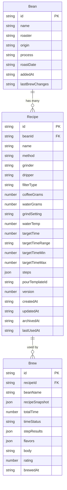

# feat: Recipe Entity MVP

## Overview

Add a first-class Recipe entity to BrewLog. Recipes are stable baselines — dialed-in settings per bean per method. They replace the current implicit "pre-fill from last brew" pattern with intentional, persistent recipe management. Multiple recipes per bean are supported.

## Problem Statement

Recipes don't exist as entities. "Recipe" is just "whatever the last brew had," re-derived via `getLastBrewOfBean()`. This causes three frequent pain points:

1. **Method switching** — Brew V60, then AeroPress. Next V60 pre-fills AeroPress settings.
2. **Experiment recovery** — Try a wild grind, it fails. Next brew pre-fills the failed experiment, not the known-good baseline.
3. **Accidental persistence** — Every tweak silently becomes the new default. No concept of "dialed-in" vs. "just trying something."

## Proposed Solution

A new `brewlog_recipes` localStorage collection with full CRUD. Recipes are explicitly managed entities linked to beans by `beanId`. The BrewScreen recipe phase loads from the selected recipe (not last brew), and pre-brew tweaks remain ephemeral unless the user explicitly saves them back.

## Data Model

### Recipe Entity

```js
{
  id: "uuid",                    // unique ID
  beanId: "uuid",                // FK to Bean.id (NOT string name)
  name: "V60",                   // defaults to method display name, user-editable
  method: "v60",                 // brew method ID
  grinder: "fellow-ode",         // equipment snapshot
  dripper: "ceramic",
  filterType: "paper-tabbed",
  coffeeGrams: 15,
  waterGrams: 240,
  grindSetting: "6-1",
  waterTemp: 200,
  targetTime: 210,               // seconds
  targetTimeRange: "3:00 - 3:30",
  targetTimeMin: 180,
  targetTimeMax: 210,
  steps: [{ id, name, waterTo, time, duration, note }],
  pourTemplateId: "standard-3pour-v60" | null,
  version: 1,                    // increment-only on updateRecipe()
  createdAt: "ISO timestamp",
  updatedAt: "ISO timestamp",
  archivedAt: null,              // soft delete timestamp
  lastUsedAt: "ISO timestamp",   // updated on brew save (not brew start)
}
```

### ERD



## Technical Approach

### Architecture

The Recipe entity follows the Bean CRUD pattern in `storage.js` (no cache initially). It integrates into the existing migration chain in `App.jsx` and the BrewScreen phase state machine. Key principle: **recipes are the source of truth for "what to brew"; brews are the record of "what happened."**

### Gap Resolutions

These gaps were identified during spec analysis and resolved with defaults:

| Gap | Resolution |
|-----|-----------|
| **Recipe creation for first-brew-of-bean** | Auto-create a recipe on brew save when no recipe exists for this bean+method. Uses the pre-tweak recipe values (from RecipeAssembly state before ephemeral adjustments). |
| **Template picker interaction** | Template picker remains for the "no recipe, no prior brews" case. Selecting a template populates RecipeAssembly. On brew save, a recipe entity is created from those values. |
| **Recipe edit UX** | In RecipeAssembly, when values differ from the loaded recipe, a "Save to Recipe" secondary action appears. Tapping it calls `updateRecipe()` with the current form values. |
| **Creating a second recipe** | Recipe picker includes a "+ New Recipe" option that opens RecipeAssembly with equipment defaults. |
| **Back-fill recipeId on old brews** | No. Existing brews keep `recipeId: undefined`. Only future brews get `recipeId`. Simpler, safer. |
| **Bean deletion cascade** | `deleteBean(id)` also sets `archivedAt` on all recipes with matching `beanId`. |
| **Missing method on legacy brews** | Migration falls back to global equipment `brewMethod`, then to `'v60'`. |
| **getChangesForBean scoping** | Filter by `recipeId` when a recipe is selected. Fall back to bean-level (current) when no recipe selected. |
| **Merge strategy** | ID-only merge (consistent with brews). Multi-device duplicates accepted as MVP limitation. |
| **Recipe name collisions** | No uniqueness constraint. Picker disambiguates with subtitle: "V60 — 15g / 240g". |
| **lastUsedAt timing** | Updated on brew save (not brew start), so abandoned brews don't affect sort order. |

### Implementation Phases

#### Phase 1: Storage Layer (`storage.js`)

Add the Recipe entity to the storage layer. This is self-contained — no component changes needed.

**Tasks:**

- [x] Add `RECIPES: 'brewlog_recipes'` to `STORAGE_KEYS` (`storage.js:14`)
- [x] Implement `getRecipes()` — parse, filter archived (`archivedAt === null`), return sorted by `updatedAt` desc
- [x] Implement `getRecipesForBean(beanId)` — filter `getRecipes()` by `beanId`
- [x] Implement `getRecipeForBeanAndMethod(beanId, method)` — filter by both, return latest by `lastUsedAt`
- [x] Implement `saveRecipe(recipe)` — validate required fields (`beanId`, `method`), assign `id`, `createdAt`, `updatedAt`, `version: 1`, write to collection
- [x] Implement `updateRecipe(id, updates)` — find by ID, merge updates, increment `version`, update `updatedAt`, write
- [x] Implement `archiveRecipe(id)` — set `archivedAt` to current timestamp (soft delete)
- [x] Implement `archiveRecipesForBean(beanId)` — archive all recipes with matching `beanId` (called by `deleteBean`)
- [x] Update `deleteBean()` to call `archiveRecipesForBean(beanId)` after removing the bean
- [x] Update `exportData()` (`storage.js:507`) to include `recipes: getRecipes()` (include archived for full export)
- [x] Update `importData()` (`storage.js:519`) to handle `recipes` key
- [x] Update `mergeData()` (`storage.js:543`) to merge recipes by ID (local wins, add new)
- [x] Both `importData` and `mergeData` must call `migrateExtractRecipes()` after writing

**Files modified:**
- `src/data/storage.js`

#### Phase 2: Migration (`storage.js` + `App.jsx`)

Extract implied recipes from existing brew history. Idempotent, synchronous, runs in the App.jsx lazy initializer chain.

**Tasks:**

- [x] Implement `migrateExtractRecipes()` in `storage.js`:
  - Idempotent check: if `brewlog_recipes` already has data, return early
  - Read all brews via `getBrews()`
  - Read all beans via `getBeans()` — build a `Map<normalizedName, beanId>` for lookups
  - Read global equipment for method fallback
  - Group brews by `normalizeName(beanName) + (method || equipment.brewMethod || 'v60')`
  - For each group: take the most recent brew (first in sorted array), extract recipe fields
  - Resolve `beanId` from the name lookup map; skip groups with no matching bean
  - Assign `id: uuidv4()`, `version: 1`, `createdAt`/`updatedAt`/`lastUsedAt` from brew's `brewedAt`
  - Set `name` to method display name via `getMethodName(method)`
  - Write all recipes to `brewlog_recipes`
  - Return `getBrews()` (no brew mutation)
- [x] Add `migrateExtractRecipes()` to App.jsx migration chain after `migrateToSchemaV2()`
- [x] Add `const [recipes, setRecipes] = useState(() => getRecipes())` to App.jsx
- [x] Update `onImportComplete` callback to include `setRecipes(getRecipes())`

**Files modified:**
- `src/data/storage.js` (migration function)
- `src/App.jsx` (migration chain, state, import callback)

#### Phase 3: BrewScreen Recipe Integration

Replace `buildRecipeFromBean` with recipe-based loading. Add recipe picker UI.

**Tasks:**

- [x] Pass `recipes` and `setRecipes` from App.jsx to BrewScreen as props (`App.jsx:121`)
- [x] Replace `buildRecipeFromBean(beanName)` with `buildRecipeFromEntity(beanId, recipes, equipment, templates)`:
  - Look up recipes for this bean via `recipes.filter(r => r.beanId === beanId)`
  - If recipes exist: select the one with latest `lastUsedAt`, populate form from its fields
  - If no recipes: fall back to equipment defaults (same as current `!lastBrew` path)
  - Return `{ ...recipeFields, _recipeId: selectedRecipe?.id || null }` (underscore prefix for the source ID, kept separate from form data)
- [x] Track `selectedRecipeId` as separate local state (NOT on the recipe object — per documented learning about UI state leaking to domain objects)
- [x] **Recipe indicator in RecipeAssembly**: Show the active recipe name as a tappable badge/chip near the top of the form. Single recipe = static label. Multiple recipes = tap opens picker.
- [x] **Recipe picker component** (inline in RecipeAssembly or small sub-component):
  - List non-archived recipes for this bean, sorted by `lastUsedAt` desc
  - Each item shows: recipe name + key params subtitle ("15g / 240g / grind 6-1")
  - "+ New Recipe" option at the bottom → resets RecipeAssembly to equipment defaults, clears `selectedRecipeId`
  - Selecting a recipe updates form state and `selectedRecipeId`
- [x] **Template picker adjustment**: Show only when `selectedRecipeId === null` AND no prior brews exist for this bean (same condition as today). Template picker populates the form but does NOT create a recipe — that happens on brew save.
- [x] **"Save to Recipe" button**: In RecipeAssembly, when values differ from the loaded recipe (compare current form state vs. recipe entity fields), show a secondary "Save to Recipe" action. Calls `updateRecipe(selectedRecipeId, diffedFields)` and `setRecipes(getRecipes())`.
- [x] **Auto-create recipe on brew save** (in `handleFinishBrew` and `handleLogWithoutTimer`):
  - If `selectedRecipeId` is null (no existing recipe was used):
    - Create a new recipe from the RecipeAssembly state (pre-tweak, using `recipe` state)
    - Call `saveRecipe(newRecipe)`, get back the ID
    - Set `recipeId` on the brew record
  - If `selectedRecipeId` is set:
    - Update `lastUsedAt` on the selected recipe: `updateRecipe(selectedRecipeId, { lastUsedAt: new Date().toISOString() })`
    - Set `recipeId` on the brew record
  - Call `setRecipes(getRecipes())` to refresh App state
- [x] Update `buildBrewRecord` (`BrewScreen.jsx:1407`) to include `recipeId` field
- [x] Update `getChangesForBean` usage: when `selectedRecipeId` is set, filter to latest brew with matching `recipeId`. Helper: `getChangesForRecipe(recipeId)` in storage.js
- [x] Update active brew persistence to include `recipeId` in `saveActiveBrew()` calls
- [x] Update crash recovery to restore `selectedRecipeId` from active brew state
- [x] Update `handleStartNewBrew` to reset `selectedRecipeId` to null

**Files modified:**
- `src/components/BrewScreen.jsx` (major changes to RecipeAssembly, buildRecipeFromBean replacement, brew save handlers)
- `src/App.jsx` (prop passing)
- `src/data/storage.js` (new helper: `getChangesForRecipe`)

#### Phase 4: BrewForm & History Preservation

Ensure existing edit flows preserve the new `recipeId` field.

**Tasks:**

- [x] Add `recipeId: editBrew.recipeId` to BrewForm's preserved fields list (`BrewForm.jsx:119-137`)
- [x] Ensure BrewHistory displays recipe name when available (optional badge on brew cards showing recipe name). Look up recipe via `recipeId` from the recipes prop, or show nothing if `recipeId` is undefined.

**Files modified:**
- `src/components/BrewForm.jsx` (one-line preservation)
- `src/components/BrewHistory.jsx` (optional recipe badge)

### Phase 5: Build Verification

- [x] Run `npm run build` to verify no compilation errors
- [x] Run `npm test` to verify existing tests pass
- [ ] Manual testing checklist:
  - Fresh app (no data): add bean → brew → verify recipe auto-created
  - Existing app (with brews): verify migration extracts recipes correctly
  - Multi-method: brew V60 → brew AeroPress → select V60 again → verify V60 recipe loads
  - Ephemeral tweaks: change grind in RecipeAssembly → brew → verify recipe unchanged
  - "Save to Recipe": change grind → tap "Save to Recipe" → verify recipe updated
  - Recipe picker: create second recipe → verify picker shows both
  - Bean deletion: delete bean → verify recipes archived
  - Export/import: export → import (merge mode) → verify recipes preserved
  - Crash recovery: start brew → force refresh → verify recipe context restored

## Acceptance Criteria

### Functional

- [x] Recipe entity exists in `brewlog_recipes` with full CRUD
- [x] Migration extracts one recipe per unique bean+method from existing brews
- [x] BrewScreen loads recipe from entity (not last brew) when available
- [x] Pre-brew tweaks do NOT auto-save to recipe
- [x] "Save to Recipe" explicitly updates the recipe when user chooses
- [x] Recipe auto-created on first brew of a new bean+method
- [x] Recipe picker shows all recipes for selected bean, auto-selects last-used
- [x] Recipe indicator visible in RecipeAssembly showing active recipe name
- [x] `recipeId` stamped on new brew records
- [x] Bean deletion cascades to archive associated recipes
- [x] Export/import includes recipes
- [x] Crash recovery preserves recipe context

### Non-Functional

- [x] No localStorage read in `onChange` handlers (buffer in state, persist on action)
- [x] All recipe write paths invalidate/refresh state correctly
- [x] No UI state leaked into recipe entity (no wizard flags, no picker state)
- [x] `npm run build` succeeds
- [x] Existing tests pass

## Dependencies & Risks

| Risk | Mitigation |
|------|-----------|
| BrewScreen.jsx is 1,620 lines; recipe picker adds complexity | Keep RecipePicker as an inline sub-component (like BeanPicker). Minimize state additions. |
| Migration could create wrong recipes for users with many methods | Idempotent migration + simple grouping (bean+method). Users can delete/archive wrong recipes. |
| Multi-device merge creates duplicate recipes | ID-only merge is consistent with brews. Document as MVP limitation. Accept duplicates. |
| Template picker and recipe picker interaction is complex | Template picker only shows when no recipes AND no prior brews. Clear conditional branching. |
| `recipeId` undefined on historical brews | Intentional. Features that use `recipeId` must handle `undefined` gracefully. |

## References & Research

### Internal

- Brainstorm: `docs/brainstorms/2026-03-03-recipe-entity-brainstorm.md`
- Storage CRUD pattern: `src/data/storage.js:44-116` (brew CRUD with cache)
- Bean CRUD pattern: `src/data/storage.js:136-196` (no cache, dedup)
- Migration chain: `src/App.jsx:31-35`
- buildRecipeFromBean: `src/components/BrewScreen.jsx:1324-1362`
- buildBrewRecord: `src/components/BrewScreen.jsx:1407-1451`
- RecipeAssembly: `src/components/BrewScreen.jsx:166-739`
- Export/import: `src/data/storage.js:507-585`
- BrewForm preservation: `src/components/BrewForm.jsx:119-137`

### Institutional Learnings

- String refs orphan on rename: `docs/solutions/logic-errors/string-reference-rename-orphans-records.md` → Using `beanId` (UUID) instead of `beanName`
- Cache mutation breaks sort: `docs/solutions/logic-errors/cache-mutation-breaks-sort-invariant.md` → Start without cache; if added, follow exact brew pattern
- Edit form overwrites unmanaged fields: `docs/solutions/logic-errors/edit-form-overwrites-fields-it-doesnt-manage.md` → Preserve `recipeId` in BrewForm
- UI state leaks to domain objects: `docs/solutions/react-patterns/ui-state-in-data-objects-leaks-to-persistence.md` → Keep `selectedRecipeId` as separate state
- Per-keystroke writes: `docs/solutions/performance/per-keystroke-localstorage-writes-cause-render-cascade.md` → Buffer recipe edits, persist on action
- Reset handler must clear all state: `docs/solutions/react-patterns/reset-handler-must-clear-all-related-state.md` → Reset `selectedRecipeId` in handleStartNewBrew
- Lazy init goes stale: `docs/solutions/state-management/lazy-init-state-goes-stale-on-prop-change.md` → Use `useMemo` for recipe derivation from bean selection
- New code path drops side effects: `docs/solutions/logic-errors/new-code-path-drops-side-effects.md` → Both handleFinishBrew and handleLogWithoutTimer must create/link recipes
